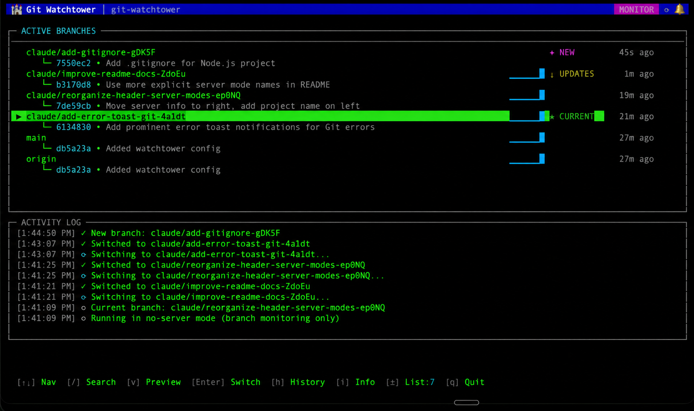
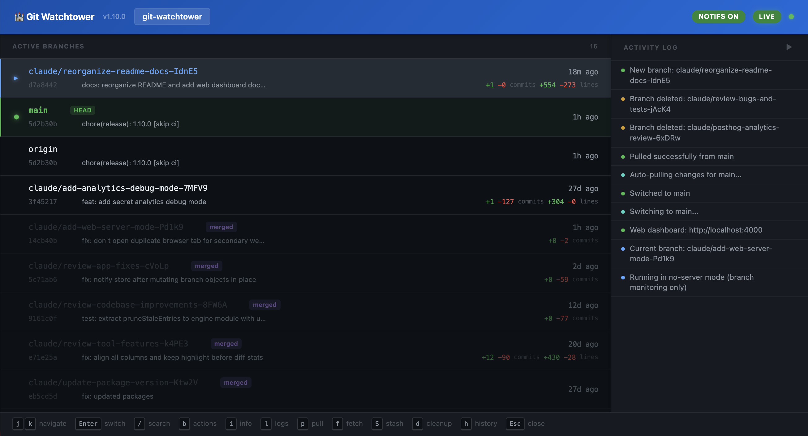

# Git Watchtower

[](https://www.npmjs.com/package/git-watchtower)
[](https://www.npmjs.com/package/git-watchtower)
[](LICENSE)

Monitor and switch between git branches in real-time. Built for working with web-based AI coding agents, like Claude Code Web & Codex.

- **Live branch monitoring** with activity sparklines and ahead/behind counters
- **Web dashboard** for browser-based branch management and PR workflows
- **Instant notifications** with visual and audio alerts when branches update
- **Quick switching** with preview pane, undo, and stash integration
- **Auto-pull** when your current branch has remote changes
- **Optional dev server** with live reload, or run your own command (Next.js, Vite, etc.)
- **Zero dependencies** — uses only Node.js built-in modules



## Why Git Watchtower?

When you're using AI coding agents on the web (Claude, OpenAI Codex, etc.) they create branches and push commits while you're not looking. You end up with multiple branches to check on and no easy way to know when they've been updated or what changed.

Git Watchtower watches your remote and notifies you when branches are updated. Preview what changed, switch with a keypress, undo if needed.

Also works for human collaborators, but the primary use case is keeping tabs on AI agents coding on different branches.

## Web Dashboard

Launch a browser-based dashboard alongside the terminal UI with `--web`:

```bash
git-watchtower --web
```



The web dashboard provides real-time branch monitoring, PR workflows, CI status, session statistics, and more — all in a rich browser interface. When running multiple instances across different projects, they coordinate automatically into a single multi-project dashboard.

Press `W` in the TUI to toggle the web dashboard on or off at any time.

[Full web dashboard documentation &rarr;](docs/web-dashboard.md)

## Installation

```bash
# Global install (recommended)
npm install -g git-watchtower

# Or run directly with npx
npx git-watchtower
```

## Quick Start

```bash
# Navigate to any git repository
cd your-project

# Start Git Watchtower
git-watchtower
```

On first run, you'll be guided through a configuration wizard.

## Usage

```bash
# Run with default settings (or saved config)
git-watchtower

# Run without dev server (branch monitoring only)
git-watchtower --no-server

# Launch with web dashboard
git-watchtower --web

# Specify custom ports
git-watchtower --port 8080 --web --web-port 9000

# Re-run the configuration wizard
git-watchtower --init

# Show help
git-watchtower --help
```

[Full CLI reference &rarr;](docs/configuration.md#cli-flags)

## Server Modes

Git Watchtower supports three server modes:

| Mode | Flag | Description |
|------|------|-------------|
| **Static Site** | `--mode static` | Built-in server with live reload for HTML/CSS/JS (default) |
| **Custom Command** | `--mode command -c "npm run dev"` | Run your own dev server (Next.js, Vite, Nuxt, etc.) |
| **No Server** | `--no-server` | Branch monitoring only |

[Full server modes documentation &rarr;](docs/server-modes.md)

## Configuration

Settings are saved to `.watchtowerrc.json` in your project directory. Key settings:

| Setting | Description | Default |
|---------|-------------|---------|
| Server mode | static, command, or none | static |
| Port | Server port number | 3000 |
| Web dashboard | Enable browser dashboard | false (use `--web`) |
| Auto-pull | Auto-pull when current branch has updates | true |
| Polling interval | How often to check for git updates | 5 seconds |
| Sound notifications | Audio alerts for updates | true |
| Visible branches | Number of branches shown in list | 7 |

[Full configuration reference &rarr;](docs/configuration.md)

## Keyboard Controls

| Key | Action |
|-----|--------|
| `Up` / `k`, `Down` / `j` | Navigate branch list |
| `Enter` | Switch to selected branch |
| `v` | Preview branch (commits & files) |
| `/` | Search/filter branches |
| `b` | Branch actions (PR, CI, merge, approve) |
| `u` | Undo last branch switch |
| `S` | Stash changes |
| `W` | Toggle web dashboard |
| `q` | Quit |

[Full keyboard reference &rarr;](docs/keyboard-controls.md)

## Requirements

- **Node.js** 18.0.0 or higher
- **Git** installed and in PATH
- **Git remote** configured (any name, defaults to `origin`)
- **Terminal** with ANSI color support

## How It Works

1. **Polling** — Runs `git fetch` periodically to check for updates
2. **Detection** — Compares commit hashes to detect new commits, branches, and deletions
3. **Auto-pull** — When your current branch has remote updates, pulls automatically (if enabled)
4. **Server** — Depending on mode, serves static files, runs your command, or does nothing
5. **Live Reload** — In static site mode, notifies connected browsers via SSE when files change
6. **Web Dashboard** — Optional browser UI that mirrors and extends the TUI via SSE

## Troubleshooting

Common issues and solutions are covered in the [troubleshooting guide](docs/troubleshooting.md).

## Contributing

Contributions are welcome! See [CONTRIBUTING.md](CONTRIBUTING.md) for guidelines.

## Development

```bash
# Clone the repository
git clone https://github.com/drummel/git-watchtower.git
cd git-watchtower

# Create a global symlink (changes take effect immediately)
npm link

# Run from any git repository
git-watchtower

# Run tests
npm test

# Run directly without installing
node bin/git-watchtower.js
```

## License

MIT License - see [LICENSE](LICENSE) for details.
